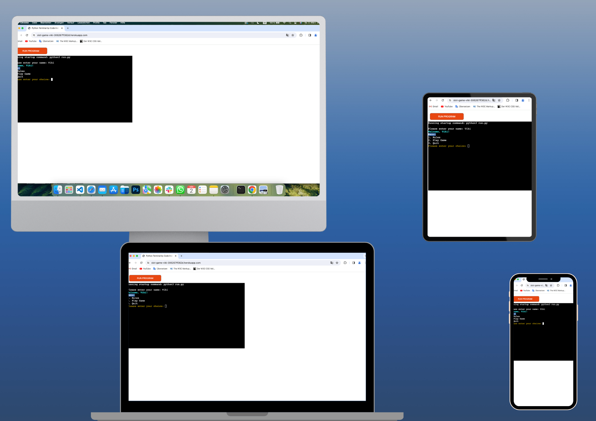
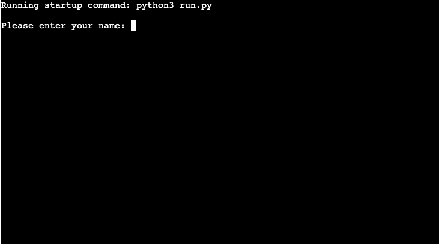
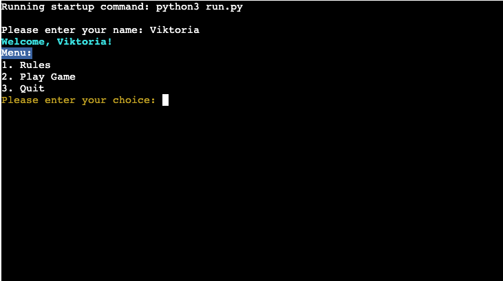
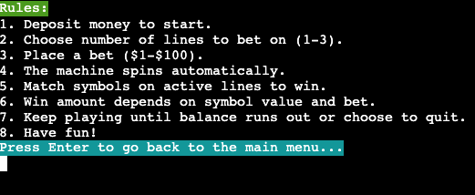
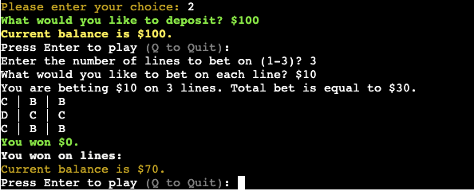
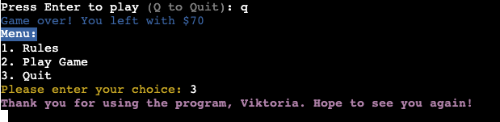
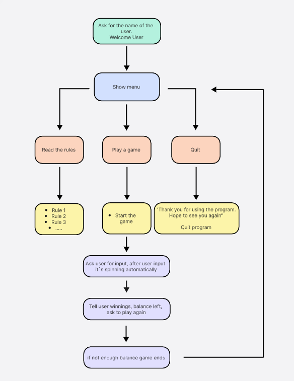
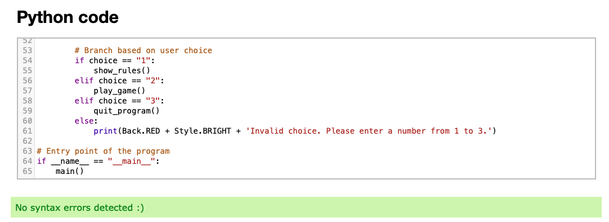
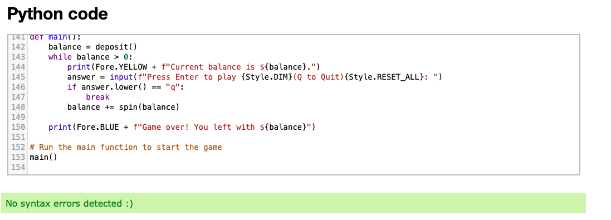

# Slot Machine Game

The link to the [slot game](https://slot-game-viki-306267ff362d.herokuapp.com/)

This project implements a simple command-line slot machine game in Python. Players can deposit money, place bets, and spin the slot machine to win prizes. The game offers multiple lines for betting and displays the outcome of each spin.

## How to Play

1. **Start the game**: Click this [link](https://dashboard.heroku.com/apps/slot-game-viki/deploy/github) or copy this text: `https://dashboard.heroku.com/apps/slot-game-viki/deploy/github` and paste it into your browser's address bar.
2. **Run the program**: As soon as the page is loaded, click 'RUN PROGRAM'.
3. **Introduce yourself**: Follow the prompts to introduce yourself to the program.
4. **Learn the rules**: Read and understand the rules presented.
5. **Play the game**: Type the words and numbers according to the instructions and hit 'Enter' on your keyboard to try your luck.
6. **Play again**: Play one more time with different amounts for even more fun.
7. **Quit the game**: When you're done, choose "Quit" and send the link to this program to your friends!

## User Stories

1. As a player, I want to be able to deposit money into the game so that I can start playing with a balance.
   
2. As a player, I want to learn the rules of the game so that I can understand how to play effectively.

3. As a player, I want to be able to place bets on multiple lines to increase my chances of winning.

4. As a player, I want the game to display the outcome of each spin clearly so that I can see if I've won or lost.

5. As a player, I want to have a user-friendly interface with clear instructions so that I can easily navigate and enjoy the game.

6. As a player, I want to be able to quit the game so that I can stop playing when I'm finished.

## Features

- **Upon launching the program**

  When the program is launched, the user is prompted to enter their name to personalize the experience.

  

- **After entering the name**

  Once the user enters their name, a personalized greeting is displayed, along with a brief instruction on the next steps. The main menu is presented, offering options to learn the rules, play the game, or quit.

  

- **Learning the rules**

  If the user chooses to learn the rules, they are presented with the rules of the slot machine game. After reading the rules, they can return to the main menu to choose another option.

  

- **Playing the game**

  When the user selects to play the game from the main menu, the slot machine is initiated. They can choose the number of lines to bet on and the amount to bet per line. After spinning the machine, the outcome is displayed, indicating any winnings. The user can continue playing or return to the main menu.

  

- **Quitting the game**

  If the user decides to quit the game, a farewell message is displayed, and the program terminates.

  

## Flowchart
The flowchart represents the logic of the application:

## Requirements

- Python 3.9.6
- colorama library (install via `pip install colorama`)
- simple term menu (install via `pip install simple-term-menu`)

## Technologies Used

### Languages

- [Python 3.9.6](https://www.python.org/downloads/release/python-396/): Used to anchor the project and direct all application behavior.
- [JavaScript](https://www.javascript.com/): Used to provide the start script needed to run the Code Institute mock terminal in the browser.
- [HTML](https://developer.mozilla.org/en-US/docs/Web/HTML): Used to construct the elements involved in building the mock terminal in the browser.

### Python Modules/Packages

- [Colorama](https://pypi.org/project/colorama/): A third-party package used for colorful terminal output. It enhances the user experience by providing colored text and backgrounds in the terminal.
- [Simple-term-menu](https://pypi.org/project/simple-term-menu/): A third-party package used for creating simple terminal menus, facilitating user interaction and navigation within the game.

### Tools and Platforms

- [VSCode](https://code.visualstudio.com/): Used as the main tool to write and edit code.
- [Git](https://git-scm.com/): Used for version control of the project.
- [GitHub](https://github.com/): Used to host the code of the project.
- [Boardmix](https://boardmix.com/): Used to create a flowchart for the README file.
- [Heroku](https://heroku.com): Used to deploy the project.

## Bugs

+ **Solved bugs**
    - Balance Not Updated: In the `spin()`` function, after deducting the total bet from the balance, the updated balance is not reflected in subsequent iterations. This led to incorrect balance calculations.
    - Dependency Removal: Since Heroku cannot handle Tkinter, any dependencies related to Tkinter need to be removed from the codebase. Failure to do so may result in errors during deployment or runtime.

+ **Unsolved bugs**
    - none

## Testing
Cyril's [online validation tool](https://extendsclass.com/python-tester.html) was used to ensure that all of the project's Python source code is [Pep 8-compliant](https://legacy.python.org/dev/peps/pep-0008/). This checking was done manually by copying Python code and pasting it into the validator.

- run.py

- main.py 

## Deployment

### Running Locally

To run the project locally, follow one of the methods below:

- **Download ZIP file**: Click on the "Code" button at the top of the GitHub repository and select "Download ZIP". Extract the contents of the ZIP file to your local machine.
  
- **Clone the repository**: Open a terminal and run the following command to clone the repository to your local machine:
`git clone https://github.com/vtoth13/slot-game-viki.git``

Alternatively, if using Gitpod, you can directly open the project in a Gitpod workspace by clicking on the Gitpod button in the GitHub repository.

### Deploying to Heroku

To deploy the project to Heroku and run it as a remote web application, follow these steps:

1. Create a Heroku account if you don't already have one.
2. Install the Heroku CLI if you haven't already done so.
3. Navigate to the project directory in your terminal.
4. Log in to Heroku using the command `heroku login`.
5. Create a new Heroku app with the command `heroku create`.
6. Push your code to Heroku using the command `git push heroku master`.
7. Once the deployment is complete, open your Heroku app in a web browser using the command `heroku open`.

Feel free to contribute to this project by opening issues or submitting pull requests.

## Credits

- [**Colorama**](https://pypi.org/project/colorama/): Developed by Jonathan Hartley, Colorama is a third-party package that enhances terminal output by providing colored text and backgrounds.
- [**Code Institute**](https://codeinstitute.net/): The project utilized a Code Institute mock terminal script written in JavaScript to create an interactive user experience in the browser.
- [**Boardmix.com**](https://boardmix.com/): Used to create a flowchart for the README file, aiding in visual representation and organization of project information.
- [**Heroku**](https://heroku.com): Used as the deployment platform for the project, allowing it to be accessed and used by users online.

## Acknowledgments

[Iuliia Konovalova](https://github.com/IuliiaKonovalova)

I am profoundly grateful to my mentor, Iuliia Konovalova, for her direction and invaluable input!

